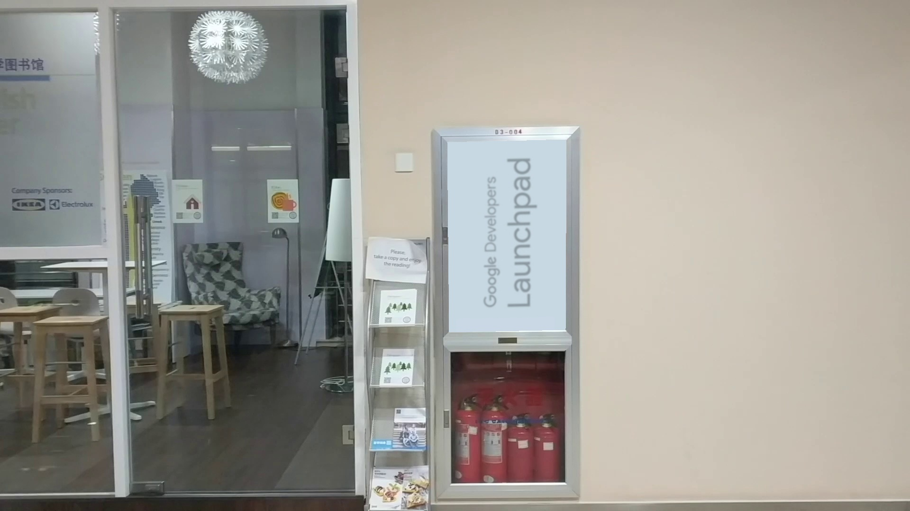

It's trying to map a image into a video, and looks natural, which is quite similiar with the projection parts in AR/VR, but easier.  
When there are enough feature points, it can just be solved by calculate the Projective transformative matrixs by the feature points, just as the demo1:

